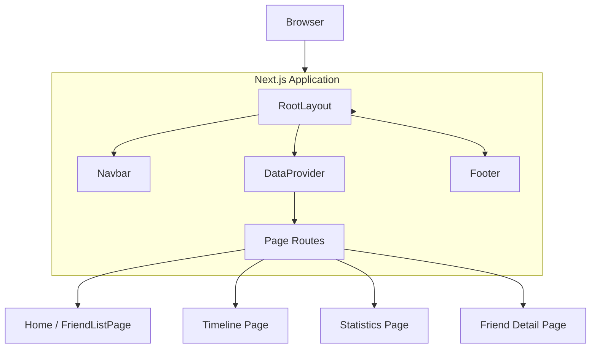
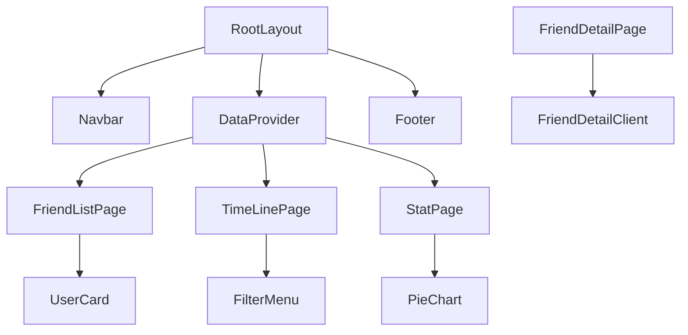

# Keen Keeper

Keen Keeper is a personal connection management dashboard built with **Next.js 16**, **React 19**, **Tailwind CSS 4**, and **Recharts**. The application helps users visualize friendship interactions, manage contact timelines, and review analytics for text, audio, and video interactions.

---

## 🚀 Project Overview

Keen Keeper provides:

- A **friend list dashboard** with summary cards and interactive friend cards.
- A **timeline page** with filtering by interaction type.
- A **stats page** with pie charts and analytics for communication types.
- A **friend detail page** for individual profiles.
- A shared **data context** to maintain interaction state across pages.

---

## 🧩 Tech Stack

- Next.js 16.2.7
- React 19.2.4
- Tailwind CSS 4
- Recharts 3.8.1
- React Icons
- React Toastify

---

## 📁 Project Structure

```text
src/
  app/
    layout.jsx
    page.jsx
    friendlist/
      page.jsx
      [id]/page.jsx
    stat/page.jsx
    timeline/page.jsx
    globals.css
  Components/
    Navbar.jsx
    Footer.jsx
    UserCard.jsx
    FriendDetailClient.jsx
  context/
    DataContext.jsx
public/
  data.json
```

---

## 🧠 Architecture

### High-level Architecture



### Component Tree




## 📌 Pages and Routes

- `/` → `src/app/page.jsx` renders `FriendListPage`
- `/friendlist` → `src/app/friendlist/page.jsx`
- `/friendlist/[id]` → `src/app/friendlist/[id]/page.jsx`
- `/timeline` → `src/app/timeline/page.jsx`
- `/stat` → `src/app/stat/page.jsx`

---

## 🔧 Key Components

### `src/context/DataContext.jsx`

- Provides a shared React context for `data` and `setData`.
- Wraps all pages inside `RootLayout`.
- Enables timeline and stats pages to access interaction data after it is loaded.

### `src/app/friendlist/page.jsx`

- Fetches interaction data from `/data.json`.
- Calculates summary metrics.
- Renders `UserCard` components for each friend.

### `src/app/friendlist/[id]/page.jsx`

- Retrieves a single friend record by `id`.
- Delegates rendering to `FriendDetailClient`.

### `src/app/timeline/page.jsx`

- Reads shared `data` from context.
- Supports filtering by `Text`, `Audio`, `Video`, or `All`.
- Displays interaction events in a vertical timeline.

### `src/app/stat/page.jsx`

- Reads shared `data` from context.
- Produces interaction analytics with Recharts.
- Renders a pie chart of interaction type distribution.

---

## 🛠️ Installation

```bash
npm install
npm run dev
```

Open the app at:

```text
http://localhost:3000
```

---

## ✅ How to Use

1. Open the home page to view your friend roster.
2. Use navigation to review interaction timeline and statistics.
3. Click a friend card to see profile details.
4. Use the status widgets to identify overdue, due soon, and on-track contacts.

---

## 📌 Notes

- The application uses client-side data loading for `FriendListPage`.
- `DataProvider` is used to persist state across rendered pages.
- Data is sourced from `public/data.json` and can be extended with additional fields.

---

## 💡 Future Improvements

- Add authentication and user-specific friend lists.
- Add create/edit/delete support for friend entries.
- Persist data to a backend or local storage.
- Improve chart interactivity and detail views.

---

## 📄 License

This repository is provided for demonstration and educational use.

